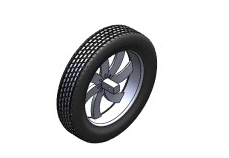
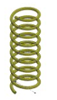
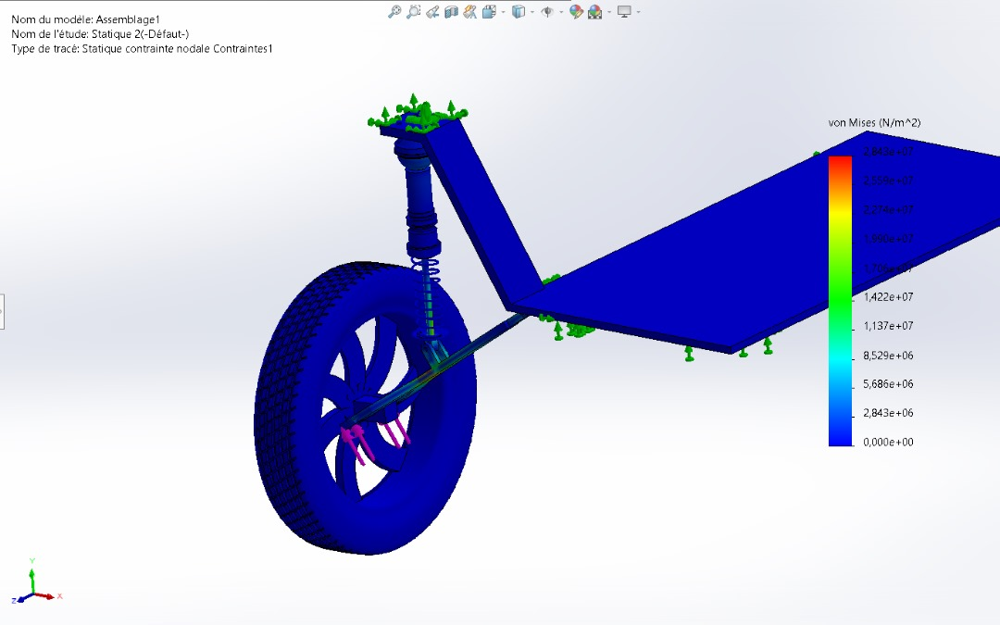

# Conception-et-validation-d-un-systeme-de-suspension-automobile
Ce projet porte sur la conception mécanique d'un système de suspension automobile comprenant une roue, un amortisseur hydraulique, un ressort hélicoïdal et une plateforme support. L'objectif est de concevoir les différents composants, réaliser leur assemblage puis d'évaluer leur comportement mécanique grâce à l'analyse statique par éléments finis. 

# Présentation du projet
Ce projet consiste à concevoir, assembler et valider mécaniquement un système de suspension automobile à l'aide de SolidWorks.
L'étude couvre l'ensemble du processus de développement d'un système mécanique, depuis la modélisation des composants jusqu'à l'analyse de leur comportement sous chargement statique.
Le système étudié comprend :

- une roue automobile ;
- un amortisseur hydraulique intégrant une membrane, un piston et une tige ;
- un ressort hélicoïdal ;
- une plateforme support représentant le châssis ;
- les différents organes de liaison nécessaires à l'assemblage.

Une analyse par éléments finis (FEA) a ensuite été réalisée afin d'étudier la répartition des contraintes dans l'ensemble de la structure.

Aperçu du projet

  

# Objectifs
Le projet réalisé avait pour objectifs de :

- Concevoir entièrement les différents composants mécaniques;
- Réaliser les assemblages sous SolidWorks;
- Effectuer le dimensionnement des principaux éléments;
- Définir les liaisons mécaniques entre les composants;
- Simuler le comportement de l'ensemble sous une charge statique;
- Analyser les contraintes et identifier les zones critiques.

# Logiciels utilisés               

 - SolidWorks pour la conception CAO;
 - SolidWorks Assembly pour la partie assemblage;
 - SolidWorks Simulation pour la partie analyse par éléments finis.

# Conception des composants
# a) Roue automobile

  

La roue a été modélisée en tenant compte de ses principaux éléments :

* Jante ;
* Pneumatique ;
* Moyeu ;
* Axe de fixation.

L'objectif était d'obtenir une géométrie compatible avec le système de suspension conçu.

# b) Amortisseur hydraulique

  
  

L'amortisseur constitue l'élément principal du système de suspension.

Il comprend notamment :

-> Un corps cylindrique ;
-> Une tige de piston ;
-> Un piston ;
-> Une membrane ;
-> Un ressort hélicoïdal ;
-> Les interfaces de fixation.

La modélisation interne permet de représenter fidèlement le principe de fonctionnement d'un amortisseur hydraulique.

# c) Ressort hélicoïdal

  

Le ressort assure la fonction de suspension en absorbant une partie des sollicitations mécaniques appliquées à la roue.

Sa géométrie a été adaptée afin de garantir son intégration avec l'amortisseur.

# d) Plateforme support

La plateforme représente le châssis du véhicule.
Elle constitue le support principal de l'assemblage et reçoit les efforts transmis par la suspension.

# e) Assemblage mécanique

  

L'ensemble des composants a ensuite été assemblé dans SolidWorks.
Les différentes liaisons mécaniques ont été définies afin de reproduire le comportement réel d'un système de suspension.
L'assemblage obtenu constitue le modèle utilisé pour les simulations mécaniques.

# f) Dimensionnement

Au cours du projet, plusieurs aspects du dimensionnement ont été pris en compte :

définition des dimensions des composants ;
intégration géométrique des pièces ;
positionnement des interfaces de fixation ;
vérification de la compatibilité entre les éléments de l'assemblage.

# g) Analyse par éléments finis

Une analyse statique a été réalisée sous SolidWorks Simulation afin d'évaluer le comportement mécanique de la suspension.

L'étude permet notamment d'observer :

la répartition des contraintes de Von Mises ;
le transfert des efforts dans la structure ;
les zones de concentration de contraintes.

# Conditions de simulation

Les conditions suivantes ont été appliquées :

encastrement de la plateforme support ;
application d'une charge verticale au niveau de la roue ;
prise en compte des contacts entre les différents composants.

# Résultats

  

La simulation met en évidence une concentration plus importante des contraintes au niveau des zones de liaison entre le bras de suspension, l'amortisseur et la plateforme.
Les autres composants présentent une répartition plus homogène des contraintes sous le chargement appliqué.
Cette étude permet d'identifier les zones les plus sollicitées et constitue une première étape vers l'optimisation de la conception.

# Compétences développées

Au travers de ce projet, les compétences suivantes ont été mobilisées :

✔ Conception mécanique
✔ Modélisation 3D sous SolidWorks
✔ Assemblages mécaniques
✔ Dimensionnement
✔ Analyse fonctionnelle
✔ Analyse par éléments finis (FEA)
✔ Interprétation des contraintes de Von Mises
✔ Documentation technique
